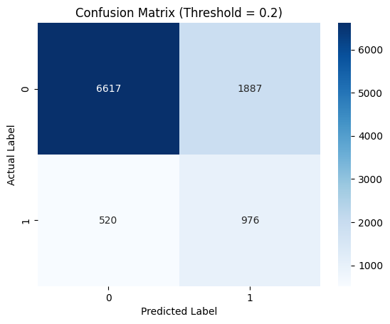
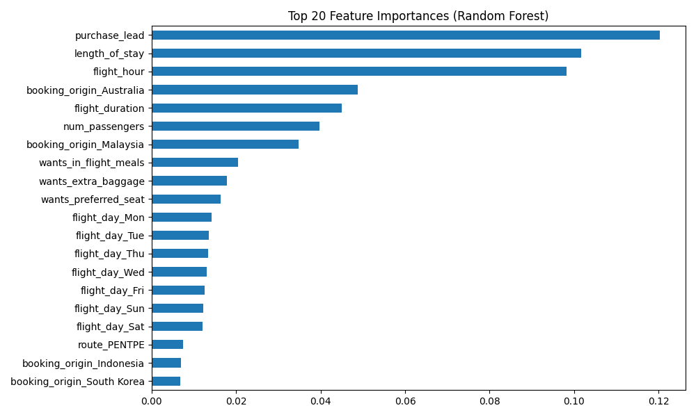

# British Airways: Customer Booking Prediction ✈️


## 📌 Project Overview
This repository contains an end-to-end machine learning pipeline developed to predict whether a customer will complete a flight booking. This project was completed as part of the **British Airways Data Science Job Simulation** via Forage. 

The primary business objective is to identify customers with high booking intent, reduce booking drop-offs, and improve marketing ROI through highly targeted campaigns.

## 📊 Dataset & Challenges
* **Dataset Size:** 50,000 historical booking records with 14 variables (e.g., `purchase_lead`, `length_of_stay`, `flight_hour`, preferences).
* **The Challenge:** The dataset is severely imbalanced, with only **~6% of users actually completing a booking**. Traditional models optimizing for accuracy would naturally fail to capture the minority class (actual buyers).

## 🛠️ Methodology & Modeling
I implemented a **Random Forest Classifier** because of its robustness to overfitting and its ability to natively handle both numerical and categorical features while providing highly interpretable feature importances.

**Pipeline Steps:**
1. **Data Preprocessing:** Handled missing values using Median/Mode imputation and applied One-Hot Encoding for categorical variables like `booking_origin`.
2. **Validation:** 80/20 Stratified Train-Test split combined with 5-fold Stratified Cross-Validation to ensure robust evaluation.
3. **Threshold Tuning:** Addressed the class imbalance by systematically shifting the decision threshold to prioritize Recall (capturing more potential buyers).

## 🚀 Key Results & Business Impact

By shifting the decision threshold from the default `0.50` to an optimized `0.20`, the model achieved a massive breakthrough in capturing high-intent customers:

* **Recall Improved by 5.7x:** Jumped from **11.5% to 65.2%**.
* **F1-Score:** Improved from **0.189 to 0.448**.
* **AUC:** Maintained a strong **0.792**.

**Final Model Performance (Threshold = 0.20):**
* **AUC:** 0.7921
* **Accuracy:** 0.7593
* **Precision:** 0.3409
* **Recall:** 0.6524
* **F1 Score:** 0.4478

### Confusion Matrix
*(Evaluated at the optimized threshold of 0.20)*


### Feature Importance
The model identified the following features as the strongest predictors of booking completion:


## 💡 Actionable Business Recommendations
Based on the machine learning insights, I propose the following strategies to the business team:
1. **Lead Scoring:** Deploy the model with the `0.20` threshold to score real-time website traffic.
2. **Targeted Remarketing:** Trigger automated remarketing emails offering slight discounts or urgency nudges specifically for users flagged with high probability but who abandoned their carts.
3. **Personalized Upselling:** Prioritize users with high `purchase_lead` and `length_of_stay` metrics (the top two most important features), pushing extra baggage or meal upsells to increase the average order value.

## 💻 How to Run
1. Clone the repository.
2. Ensure you have `pandas`, `numpy`, `scikit-learn`, `matplotlib`, and `seaborn` installed.
3. Run the main script:
   ```bash
   python booking_prediction.py
